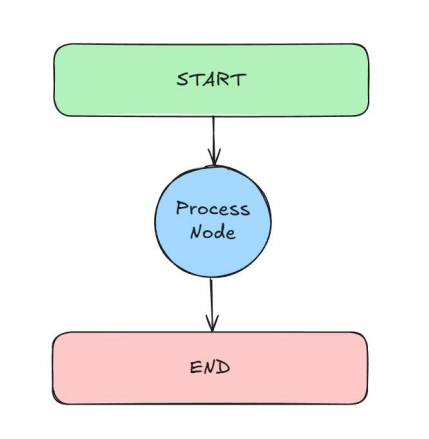
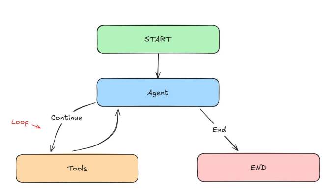
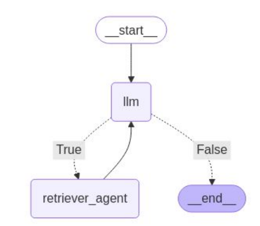

# LangGraph & RAG Introduction
This project is based on the *[LangGraph Complete Course for Beginners – Complex AI Agents with Python](https://www.youtube.com/watch?v=jGg_1h0qzaM&t=8931s)* by Vaibhav Mehra. 

There are 3 different folders in this project.
1. [Practice](Practice) has various practice problems I did to get a better understanding of LangGraph
2. [Exercise](Exercise) has my implementations which may or may not match the orginal implementation; it is my attempt at solving the challenges from what I learned.
3. [Agents](Agents) has a guided implementation of LangGraph utilizing OpenAI's model via API.

<hr>

### 1: Simple Bot🤖
Objectives:
1. Define state structure with a list of HumanMessage objects.
2. Initialize a GPT-4o model using LangChain's ChatOpenAI
3. Sending and handling different types of messages
4. Building and compiling the graph of the Agent

**Main Goal**: How to integrate LLMs in our Graphs

The implementation is very similar to the [Hello_World](Practice/1_Hello_World.ipynb) practice




<br>

### 2: Chatbot🧠
Objectives:
1. Use different message types - HumanMessage and AIMessage
2. Maintain a full conversation history using both message types
3. Use GPT-4o model using LangChain's ChatOpenAI
4. Create a sophisticated conversation loop
Main Goal: Create a form of memory for our Agent

<br>

### 3: ReAct Agent📱
**Reasoning and Acting Agent**

Objectives:
1. Learn how to create Tools in LangGraph
2. How to create a ReAct Graph
3. Work with different types of Messages such as ToolMessages
4. Test out robustness of our graph

**Main Goal**: Create a robust ReAct Agent!

This implementation is very similar to what I learned in [Exercise 5](Exercise/Exercise_Graph5.ipynb) and [Looping Graph](Practice/5_Looping_Graph.ipynb)


```python
from typing import Annotated, Sequence, TypedDict

email = Annotated[str, "This has to be a valid email format!"]

print(email.__metadata__)
```

**Annotated** - provides additional context without affecting the type itself; say you have details on emails which is a string but you want the structure of the email to be a certain way.

**Sequence** - To automatically handle state updates for sequences such as by adding new messages to a chat history. Prevent list manipulations affecting the graph nodes. 

**BaseMessage** - essentially the parent class of ``HumanMessage``, ``ToolMessage``, etc.

```python
from langgraph.graph.message import add_messages

#Without a reducer
state = {"messages": ["Hi!"]}
update = {"messages": ["Nice to meet you!"]}
new_state = {"messages": ["Nice to meet you!"]} 

#With a reducer
state = {"messages": ["Hi!"]}
update = {"messages": ["Nice to meet you!"]}
new_state = {"messages": ["Hi!", "Nice to meet you!"]} #appends it
```
**Reducer Function** - Controls how updates from nodes are comvined with the existing state. Tells us how to merge new data into the current state. Without a reducer, updates would have replaced the existing value entirely!


Note: The importance of `@tools` is that it allows the LLM to utilize functions and not simply "guess" what the answer is based on its training.

<br>

### 4: Boss’s Orders 👔
**Task**:
Our company is not working efficiently! We spend way too much time
drafting documents and this needs to be fixed!

For the company, you need to create an AI Agentic System that can
**speed up drafting documents, emails, etc.** The AI Agentic System
should have Human-AI Collaboration meaning the Human should be
able to able to provide continuous feedback and the AI Agent should
stop when the Human is happy with the draft. The system should also
**be fast and be able to save the drafts.**


```python
def should_continue(state: AgentState): 
    """Determine if we should continue or end the conversation"""
    messages = state["messages"]

    if not messages:
        return "continue"
    
    for message in reversed(messages):
        if (isinstance(message, ToolMessage) and
            "saved" in message.content.lower() and
            "document" in message.content.lower()):
            return "end"
```
The for loop in the `should_continue()` edge above indicates the following:
- Looks for the most recent tool message
- Checks if this is a tool message resulting from `save()`
- Goes to the end edge which leads to the endpoint
- This is very similiar to the structure from [Exercise 5](Exercise/Exercise_Graph5.ipynb)

### RAG 

The objective of this RAG is to scan the text from [Stock Market Performance 2024](Agents/inputs/Stock_Market_Performance_2024.pdf) and retrieve appropriate information from the text. The structure is very similar to the ReAct agent. However, there is a system prompt and the actions are more robust. There is a `retriever_tool()` which searches and retuns the information that the LLM has to use which reduces the risk of hallucination.





<hr>

# Takeaway & Conclusion

This project has been an insightful journey into the world of LangChain, LangGraph, and Large Language Models (LLMs). 

### Key Learnings:

1. **LangChain & LangGraph:**
I learned how to design, implement, and optimize LangGraphs to represent agent workflows. This allows me to build AI agents that can reason over multiple steps, interact with external tools, and dynamically adapt based on context, an essential skill for building intelligent systems.

2. **Integration with OpenAI Models:**
This project gave me hands-on experience with integrating OpenAI’s models into LangGraph agents using LangChain's ChatOpenAI. By combining the power of LLMs with a robust graph structure, I was able to create intelligent agents that can process, understand, and generate human-like responses across various tasks.

3. **RAG (Retrieval-Augmented Generation):**
I also gained an in-depth understanding of RAG and its significance in improving the reliability and accuracy of AI-generated content. By using a retriever tool to fetch relevant information from external documents (like the Stock Market Performance report), the model can make decisions based on real-world data, significantly reducing the risk of hallucinations and improving the agent's overall performance.

### How This Could Be Useful:

- **Real-World Application in Automation:** One of the most practical applications of LangGraph agents is in automating workflows that require reasoning, decision-making, and human-like interaction. For example, the Boss's Orders agent I built could easily be adapted to create AI-driven systems for automating document drafting, report generation, or even customer support tasks, saving the organization valuable time and improving efficiency.

- **Enhanced Human-AI Collaboration:** By incorporating a feedback loop into the agent's design (as seen in the Boss's Orders task), LangGraph agents can be used in collaborative environments where humans and AI work together to refine outputs iteratively. This is particularly useful in content creation, decision support systems, and even creative industries, where human feedback is crucial for fine-tuning AI-generated results.

- **Building Robust Agents for Complex Tasks:** LangGraph's modular approach to building agents makes it easy to extend and adapt agents for new use cases. Whether you're building a personal assistant, a recommendation system, or an AI-powered chatbot, LangGraph allows for flexibility and robustness, which makes it an invaluable tool in AI development.